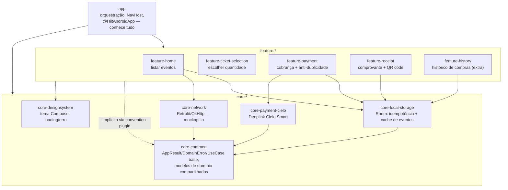
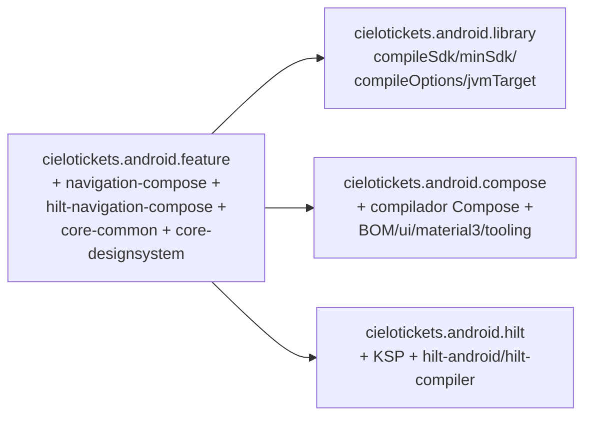

# Decisões Arquiteturais — Cielo Tickets

## Visão geral de módulos

```
app                        (orquestração, @HiltAndroidApp, NavHost — conhece tudo)
├── core:core-common        (AppResult, DomainError, UseCase base, Dispatchers,
│                            EventModel/PurchaseOrderModel/etc. — modelos de
│                            domínio compartilhados por mais de uma feature)
├── core:core-network        (Retrofit/OkHttp — catálogo de eventos via mockapi.io)
├── core:core-local-storage  (Room: PurchaseAttempt = idempotência; EventEntity = cache do catálogo remoto)
├── core:core-payment-cielo  (integração Deeplink real com a Cielo Smart)
├── core:core-designsystem   (tema Compose, componentes de loading/erro)
├── feature:feature-home             (listar eventos)
├── feature:feature-ticket-selection (escolher quantidade)
├── feature:feature-payment          (cobrança + anti-duplicidade)
├── feature:feature-receipt          (comprovante + QR code — domain/data/di
│                                      completos, reconstrói o comprovante a
│                                      partir só da idempotencyKey)
└── feature:feature-history          (histórico de compras — escopo extra,
                                       não pedido pelo case original)
```

### Grafo de dependências

Setas sólidas = dependência explícita (`implementation(projects.x)`) no
`build.gradle.kts` do módulo. Setas tracejadas = dependência implícita,
injetada automaticamente pelo plugin de convenção `cielotickets.android.
feature` em toda `feature:*` (ver seção `build-logic` abaixo) — por isso
não aparece escrita em nenhum `build.gradle.kts` de feature.



Único ponto onde `feature:*` depende de outra `feature:*`: nenhum hoje —
todo modelo compartilhado (`EventModel`, `PurchaseOrderModel`) foi movido
pra `core-common` de propósito (ver "Por que Clean Architecture" abaixo),
exatamente pra não precisar dessa aresta.

O catálogo de eventos vem de uma API real (mockapi.io, via `core-network`),
não é mais fixo/local — `EventRepositoryImpl` (`feature-home/data`) tenta a
rede primeiro e cai pro cache do Room (`EventDao`) só se a chamada falhar
(offline-first). A idempotência de pagamento continua 100% local (Room é a
única fonte de verdade pra isso, nunca precisou de rede). Ver
`FakeEventRemoteDataSource`/`EventNetworkModule` pra rodar sem o mockapi.io
configurado (mesmo padrão do `FakeCieloPaymentGateway`), e a seção
`#deploy` pra como configurar `API_BASE_URL`.

Regra dura, verificável pelo grafo de dependências do Gradle:
**`core:*` nunca depende de `feature:*`. `feature:*` pode depender de `core:*`
e, quando compartilha modelo de domínio (ex. `Event`), de outra `feature:*`
específica — mas nunca do `app`.** Isso mantém o paralelismo real de build:
o Gradle pode compilar todos os módulos `core` em paralelo, e as `feature`
em paralelo entre si assim que seus `core` terminam.

## `build-logic`: plugins de convenção

Todo o boilerplate de `android { compileSdk/minSdk/compileOptions }`,
Compose e Hilt que se repetia em cada `build.gradle.kts` foi extraído para
`build-logic/convention` (composite build incluído via
`pluginManagement.includeBuild("build-logic")` no `settings.gradle.kts` raiz).
Plugins registrados (aplicados via `alias(libs.plugins.cielotickets.*)`):

- `cielotickets.android.library` / `cielotickets.android.application`:
  `compileSdk`/`minSdk`/`compileOptions`/`jvmTarget` comuns.
- `cielotickets.android.compose`: liga Compose (plugin do compilador +
  `buildFeatures.compose` + BOM/ui/material3/tooling) em qualquer módulo já
  configurado por um dos dois acima.
- `cielotickets.android.hilt`: KSP + plugin do Hilt + dependência
  `hilt-android`/`hilt-compiler`.
- `cielotickets.android.feature`: agrega library + compose + hilt +
  `hilt-navigation-compose` + `navigation-compose` (pro `SavedStateHandle`
  ler os argumentos de rota — ver seção de navegação abaixo) +
  `core-common`/`core-designsystem` — o que toda `feature:*` com
  `@HiltViewModel` via Compose precisa. As 5 features usam.
- `cielotickets.android.test.junit5`: `testOptions.unitTests.useJUnitPlatform()`
  + JUnit5/MockK/Turbine, nos módulos com testes reais (`core-network` e as
  5 `feature:*`).

### Composição dos plugins

`cielotickets.android.feature` não é um plugin do zero — é composição dos
outros três + dependências fixas que toda feature com `@HiltViewModel` via
Compose precisa. É por isso que o `build.gradle.kts` de uma feature nova
(ex. `feature-history`, 10 linhas — `plugins {}` + `dependencies {}`, nem
precisa de bloco `android {}`, já que o `namespace` também é automático —
ver adiante) não repete `compileSdk`/`minSdk`/Compose/Hilt/navigation:



`cielotickets.android.test.junit5` fica de fora dessa composição de
propósito — nem todo módulo tem teste real, então é aplicado à parte só
onde há suíte (ver lista acima).

Dependências entre módulos usam os accessors tipados do Gradle
(`enableFeaturePreview("TYPESAFE_PROJECT_ACCESSORS")` no `settings.gradle.kts`
raiz) — `projects.core.coreLocalStorage` em vez de
`project(":core:core-local-storage")` — para pegar erro de digitação em
tempo de compilação do script, não só quando o Gradle tenta resolver o
módulo.

**Pegadinha do Gradle 9 encontrada e corrigida aqui:** por um bom tempo,
todo módulo que aplicava um plugin de convenção (caso de todo
`cielotickets.*`, vindo de um *included build*) perdia, nesse mesmo
arquivo, a parte **tipada** do accessor do catálogo — `libs.core.ktx` dava
"Unresolved reference", só `libs.findLibrary("core-ktx").get()` funcionava.
Causa raiz (achada comparando com repositórios de referência, reproduzida
isolada num módulo de teste): as classes de `build-logic/convention/src/
main/kotlin/*.kt` estavam todas no **pacote padrão** (sem `package`
declarado) — isso colide com o accessor sintético `libs` que o próprio
Gradle gera pro script, e o Gradle recua pro tipo genérico. Solução: mover
todas as classes de convention plugin para um pacote nomeado
(`br.com.cielotickets.buildlogic.convention`) — os accessors tipados
(`libs.foo.bar`) voltam a funcionar em todo `build.gradle.kts` do projeto,
sem exceção.

De quebra, `namespace = "br.com.cielotickets.x.y"` não precisa mais ser
repetido em cada módulo: `configureKotlinAndroid` deriva automaticamente do
path do Gradle (`:core:core-local-storage` -> `br.com.cielotickets.core.
localstorage`), com override ainda possível no `build.gradle.kts` do módulo
se algum nome fugir do padrão (a atribuição do script roda depois da do
plugin).

## Por que Clean Architecture + MVVM por feature

Cada `feature:*` segue `domain/ → data/ → presentation/ → di/`:
- `domain`: modelos e regras de negócio puras (sem Android, sem Room).
- `data`: implementação concreta (Room DAO, mapeamento Entity → domínio).
- `presentation`: ViewModel (`@HiltViewModel`, estado imutável via `StateFlow`) + Composables.
- `di`: `@Module @InstallIn(SingletonComponent::class)` só quando a feature
  precisa de `@Binds`/`@Provides` (ex. bindar uma interface de domínio a
  sua implementação) — `UseCase`s e `ViewModel`s não precisam de módulo
  próprio, ganham `@Inject constructor` direto e o Hilt resolve sozinho.

Isso torna o `domain` 100% testável em JVM puro e isola qualquer troca de
fornecedor (ex. trocar a fonte local por uma API real no futuro) na camada
`data`.

**Repository e UseCase são sempre interface + Impl**, nunca classe
concreta injetada direto no ViewModel (`EventRepository`/
`EventRepositoryImpl`, `GetAvailableEventsUseCase`/
`GetAvailableEventsUseCaseImpl`, etc.), ligados via `@Binds` no `di/` de
quem os implementa. `PurchaseRepository` (`feature-payment`) é o exemplo
mais recente: `ProcessPaymentUseCase` dependia direto de
`PurchaseAttemptDao` (Room) — violava Dependency Inversion (domínio
conhecendo o framework de persistência) e destoava do padrão já usado por
`ReceiptRepository`/`PurchaseHistoryRepository`. Corrigido introduzindo a
interface + `PurchaseAttemptModel` (modelo de domínio puro, sem Room).

## Anti-duplicidade de cobrança (requisito não-funcional crítico)

Ponto mais sensível do case. Estratégia adotada em `feature-payment`:

1. Cada **pedido** (não cada request HTTP) recebe uma `idempotencyKey`
   (UUID) gerada uma única vez pela `PaymentViewModel`, sobrevivendo a
   qualquer reenvio dentro daquela tela (retry de rede, duplo toque).
2. Antes de chamar o gateway, `ProcessPaymentUseCase` grava (via
   `PurchaseRepository`) uma linha `PENDING` com essa chave.
3. Se a mesma chave já tiver uma tentativa `APPROVED` (já cobrou) ou
   `PENDING` (pode estar em andamento) registrada, o caso de uso **não
   chama a Cielo de novo** — retorna o resultado já persistido. `DENIED`/
   `CANCELLED`/`ERROR` não chegaram a cobrar nada, então "Tentar novamente"
   dispara uma cobrança de verdade de novo com a mesma chave — só o
   resultado final é que sobrescreve a linha.
4. A `PaymentViewModel` bloqueia novos cliques enquanto `Processing`,
   cobrindo o caso mais comum de duplicidade (duplo toque de UI).

## Tratamento diferenciado por tipo de falha (Negada vs. Cancelada/Timeout)

O case pede tratamento **diferente** pra cada um dos 3 desfechos possíveis
de um pagamento, não um "deu erro" genérico:

- **Aprovada**: `PaymentUiState.Success` → navega pro comprovante com QR Code.
- **Negada** (`DomainError.PaymentDenied`): `PaymentUiState.Failed` — fica
  na própria tela de pagamento, mensagem específica de negada, botão
  "Tentar novamente" (mesma `idempotencyKey`, sem perder o carrinho).
- **Cancelada/Timeout** (`DomainError.PaymentCancelled`, `DomainError.Timeout`,
  e o botão manual "Cancelar" durante `Processing`): `PaymentUiState.Cancelled`
  — a `PaymentScreen` reage com um `LaunchedEffect` que aciona
  `onCancelled()`, e o `CieloNavHost` faz `popBackStack()` de volta pra
  `TicketSelectionRoute`. Como essa tela nunca sai do back stack (só ganha
  outra por cima), seu `TicketSelectionViewModel` sobrevive com o estado
  intacto — inclusive a quantidade escolhida. Isso hoje é garantia de
  lifecycle do próprio Android (o ViewModel só é criado uma vez por
  `NavBackStackEntry`, e seu `init` só roda naquela primeira vez), não mais
  uma checagem manual de "é o mesmo evento?" — ver seção de navegação
  tipada abaixo.

Diferença de UX proposital: "negada" mantém o cliente na tela de pagamento
(ele pode querer tentar outro cartão ali mesmo); "cancelada/timeout" tira o
cliente da tela de pagamento e devolve pro resumo do pedido — reflete que
nesses dois casos a intenção mais provável é revisar o pedido antes de
tentar de novo, não bater no mesmo botão imediatamente.

## Integração Cielo Smart (via Deeplink)

O SDK nativo da Cielo Lio foi **descontinuado** (recebe apenas patches) e a
própria Cielo recomenda oficialmente a **integração via Deeplink** para a
nova geração de terminais Cielo Smart — é o modelo demonstrado no repositório
[LIO-SDK-Sample-Integracao-Local](https://github.com/DeveloperCielo/LIO-SDK-Sample-Integracao-Local)
e usado como referência aqui. Vantagem prática para este case: funciona
direto contra o **emulador Cielo Smart** exigido no enunciado, sem precisar
publicar nenhum `.aar` num repositório Maven local.

Fluxo implementado em `core-payment-cielo/deeplink/`:

1. `CieloDeeplinkCodec` monta o JSON de checkout (`CieloCheckoutRequestPayload`)
   com `reference = idempotencyKey` do nosso pedido, Base64-encoda e monta a
   URI `lio://payment?request=...&urlCallback=order://response`.
2. `CieloDeeplinkPaymentGateway.charge()` dispara essa URI via
   `Intent(ACTION_VIEW)` — isso abre a Cielo Smart/emulador em outro app — e
   **suspende** aguardando o resultado.
3. A Cielo Smart devolve o controle chamando de volta `order://response?response=BASE64`.
   Isso é recebido por `CieloResponseActivity` (declarada no
   `AndroidManifest.xml` do próprio módulo `core-payment-cielo`, que faz merge
   automático no manifest do `app` — um dos poucos casos em que um `core`
   contribui algo "visível" para o app final, mas sem depender de nenhuma
   `feature`).
4. `CieloResponseActivity` decodifica o JSON e publica o resultado em
   `CieloDeeplinkResultBus` (um `SharedFlow` singleton de processo) — essa
   ponte é necessária porque o callback chega numa Activity nova, desacoplada
   da tela que iniciou o pagamento.
5. `CieloDeeplinkPaymentGateway` retoma a coroutine suspensa, correlacionando
   pelo campo `reference` (nossa `idempotencyKey`) e com timeout de 5 minutos,
   e mapeia o JSON de volta para `CieloChargeResult` — o resto do app nunca
   viu formato de JSON da Cielo, só `feature-payment` conhece `CieloChargeResult`.

**Forma de pagamento escolhida na maquininha, não no app**: `paymentCode`
em `CieloCheckoutRequestPayload` é opcional e vai `null` (omitido do JSON
por causa de `explicitNulls = false`). Sem esse campo, a própria Cielo
Smart pergunta ao cliente a forma de pagamento (crédito à vista, parcelado,
débito — o que estiver habilitado nas credenciais do lojista) na tela da
maquininha, em vez de uma tela nossa. Evita, de propósito, o risco de
mandar um código fixo (ex. `CREDITO_AVISTA`) que o lojista não tenha
habilitado — nesse caso a Cielo Smart recusaria a transação.

Configuração necessária antes de rodar contra o emulador:
- `Client-Id` e `Access-Token` gerados no
  [Portal do Desenvolvedor Cielo](https://desenvolvedores.cielo.com.br/api-portal/myapps),
  configurados como `CIELO_CLIENT_ID`/`CIELO_ACCESS_TOKEN` no `local.properties`
  (gitignorado) — viram `BuildConfig.CIELO_CLIENT_ID`/`CIELO_ACCESS_TOKEN` em
  `core-payment-cielo`, lidos por `DevCieloCredentialsProvider`. Sem essas
  chaves, cai num placeholder óbvio (`SEU_CLIENT_ID_AQUI`) — o projeto
  continua compilando, só não autentica de verdade contra a Cielo. Ver
  `#deploy` abaixo.
- `meta-data android:name="cs_integration_type" android:value="uri"` no
  `AndroidManifest.xml` do `app` — obrigatório para publicação em terminais
  Cielo Smart (já incluído).

`ProcessPaymentUseCaseTest` mocka `CieloPaymentGateway` diretamente com
MockK — não faz sentido, nem é possível, abrir outro app/Activity num teste
JVM puro. `FakeCieloPaymentGateway` continua existindo à parte, como opção
para rodar o app manualmente sem o emulador instalado: basta trocar o alvo
do `@Binds bindPaymentGateway` em `PaymentGatewayModule` para apontar para
ela (com Hilt essa troca é em tempo de compilação, diferente do binding
dinâmico que o Koin permitia).


## Navegação tipada e sobrevivência a `process death` {#process-death}

Motivação: o fluxo inteiro deste app depende de sair pro app da Cielo Smart
(via Deeplink) e voltar — exatamente a janela em que o Android mais mata
processos em background por memória. Até uma versão anterior deste projeto,
`selectedEvent`/`currentOrder`/`currentReceipt` viviam em
`remember { mutableStateOf(...) }` no `CieloNavHost`, o que se perde por
completo quando o processo morre: o usuário voltava pra Home do zero, e —
pior — a `idempotencyKey` da cobrança em andamento também se perdia, abrindo
uma janela real de cobrança duplicada (um "tentar de novo" pós-restauração
geraria uma chave nova, e o curto-circuito de idempotência nunca
encontraria a tentativa antiga).

**Solução**: rotas tipadas via Navigation-Compose 2.8 (`@Serializable`, um
arquivo por feature em `navigation/*Route.kt` — cada rota mora no módulo da
própria feature, nunca no `:app`, porque a regra de dependência é
`feature:* → core:*` e nunca o contrário). Cada tela recebe só um ID
primitivo (`eventId`, `quantity`, `idempotencyKey`) em vez de um objeto de
domínio inteiro, e o próprio ViewModel recarrega o que precisa via
`SavedStateHandle` + um `UseCase` (`GetEventByIdUseCase`, `GetReceiptUseCase`):

- `TicketSelectionViewModel`/`PaymentViewModel` reconstroem o
  `EventModel`/`PurchaseOrderModel` a partir do `eventId`.
- `ReceiptViewModel` reconstrói o `PurchaseReceiptModel` inteiro a partir só
  da `idempotencyKey`, via `ReceiptRepository` (que por baixo combina
  `PurchaseAttemptDao.findByKey` — hoje o comprovante não precisa mais
  cruzar com `EventDao`, o `eventTitle` já vem denormalizado na própria
  `PurchaseAttempt`) — por isso `feature-receipt` ganhou uma camada
  `domain/data/di` completa (antes era só 2 arquivos de `presentation`,
  sem repositório nenhum).
- **Ponto crítico**: a `idempotencyKey` gerada pela `PaymentViewModel` é
  persistida no próprio `SavedStateHandle` (`savedStateHandle["idempotency_key"] = ...`),
  não só num campo em memória. Se o processo morrer com uma cobrança
  `PENDING`, o ViewModel recriado continua vendo a MESMA chave — é isso que
  fecha a janela de dupla cobrança descrita acima. Coberto por teste
  unitário dedicado em `PaymentViewModelTest` (duas instâncias do ViewModel
  compartilhando o mesmo `SavedStateHandle`, confirmando que a chave usada
  na cobrança é idêntica nas duas).

**Detalhe de implementação**: os ViewModels leem os campos da rota via
`savedStateHandle.get<String>("eventId")` direto, **não** via
`savedStateHandle.toRoute<Route>()`. O decoder de `toRoute()` passa por
`android.os.Bundle` por baixo dos panos (confirmado empiricamente pelo
stack trace), que não é mockado em teste unitário puro — só funciona em
instrumentado ou com Robolectric. `get()` simples lê do mapa interno do
próprio `SavedStateHandle` e funciona idêntico nos dois ambientes, sem
precisar de Robolectric só para isso. Trade-off consciente:
a chave string (`"eventId"`) tem que casar com o nome do campo na `Route`
— um rename futuro do campo não é pego pelo compilador nessa ponta
específica, mas os testes instrumentados (que exercitam a navegação real de
ponta a ponta) pegariam a quebra na hora.

## Testes críticos cobertos

- `HomeViewModelTest`: sucesso ao carregar eventos reflete no `StateFlow`;
  catálogo vazio vira `Success(emptyList())`, não `Error` (são branches
  diferentes — só falha de repositório é erro).
- `TicketSelectionViewModelTest`/`PaymentViewModelTest`/`ReceiptViewModelTest`/
  `HistoryViewModelTest`: carregam o domínio a partir do `eventId`/
  `idempotencyKey` da rota (mock de `GetEventByIdUseCase`/`GetReceiptUseCase`/
  `GetPurchaseHistoryUseCase`), cobrindo sucesso e "não encontrado".
- `EventRepositoryImplTest`: cobre o fallback offline-first — rede falha,
  cai pro cache do Room; cache vazio e rede falha, propaga o erro de
  verdade.
- `EventMapperTest` (`core-network`): `EventResponse` → `EventModel`
  preserva todos os campos, `imageUrl` nulo no JSON não quebra o parse.
- `ProcessPaymentUseCaseTest`:
  - reenvio com a mesma `idempotencyKey` **não** dispara nova chamada ao
    gateway (o teste que mais importa para este case);
  - pagamento aprovado grava `status = APPROVED` com o `transactionId`.

### Cobertura medida (Kover) {#cobertura}

Agregada na raiz (`build.gradle.kts`) via `kover(project(...))` por
módulo — cada módulo Android precisa aplicar o plugin também (não só a
raiz), senão o Kover não sabe qual variante (debug/release) expor pro
relatório agregado; por isso `configureKotlinAndroid`
(`build-logic/convention/src/main/kotlin/KotlinAndroid.kt`) aplica
`org.jetbrains.kotlinx.kover` pra todo módulo automaticamente, mesmo
ponto onde já derivamos o `namespace`. Excludes configurados: código
gerado (`*_Factory`, `Hilt_*`, `*_Impl`, `BuildConfig`) e pacotes `di/`
(`@Binds` não tem corpo pra cobrir; `@Provides` só roda com o grafo do
Hilt de pé, não em teste unitário puro) — sem isso a métrica fica diluída
por código que não é nosso.

`./gradlew koverHtmlReport` → `build/reports/kover/html/index.html`.
Rodado no CI a cada push, publicado como artifact. Número agregado (~20%
de linha) reflete a pirâmide de teste documentada acima, não descuido:
`presentation/` (Compose) e `core-designsystem` são cobertos por
instrumentado, não por linha unitária. Onde a régua importa —
`feature-payment/domain` (82%), `core-local-storage/db` (63%),
`core-network/events` (62%) — o número é bem mais alto. Achado real do
relatório: `PurchaseRepositoryImpl`/`ReceiptRepositoryImpl`/
`PurchaseHistoryRepositoryImpl` (mapeamento Entity↔Model) em 0% — só
exercitadas indiretamente via mock da interface nos testes de UseCase,
registrado como próximo passo em `README.md`.

## Testes instrumentados (`app/src/androidTest`) {#instrumented-tests}

Rodam de verdade num dispositivo/emulador (`./gradlew :app:connectedDebugAndroidTest`),
via `MainActivity` + `CieloNavHost` reais — diferente dos testes unitários,
aqui a gente exercita navegação, back stack e composição de tela juntos, que
foi exatamente onde os bugs mais difíceis deste projeto apareceram (ver
seção de trade-offs/histórico). Usam **JUnit4** (não JUnit5): o
`ComposeTestRule`/`AndroidJUnitRunner` do ecossistema androidx.test são
construídos sobre JUnit4 — forçar JUnit5 aqui seria nadar contra a maré do
ecossistema sem ganho real, então os dois convivem no projeto por design
(unitário = JUnit5, instrumentado = JUnit4).

**DI de teste** (`app/src/androidTest/.../di/`): `HiltTestRunner` troca a
`Application` por `HiltTestApplication`, o que ativa os módulos
`@TestInstallIn`:
- `TestPaymentGatewayModule` — substitui a integração real (abre a Cielo
  Smart via Deeplink) por `ControllableFakePaymentGateway`, que cada `@Test`
  reconfigura (`nextResult`/`responseDelayMs`) antes de tocar em "Pagar".
  Sem isso, o teste dependeria de um emulador Cielo Smart instalado no
  dispositivo de CI e de interação manual no app dele.
- `TestLocalStorageModule` — Room em memória, sem seed (o catálogo não é
  mais fixo desde o mockapi.io).
- `TestEventNetworkModule` — substitui `EventNetworkModule` por
  `FakeEventRemoteDataSource` (mesma fixture `SeedEvents` da produção),
  pra não depender do mockapi.io de verdade nem ficar não-determinístico.

**Cobertura**: `HomeScreenInstrumentedTest` (CT-01) e
`PurchaseFlowInstrumentedTest` (CT-02 a CT-05 + duas regressões achadas via
teste manual nesta sessão: pilha de navegação duplicando "receipt" ao voltar
depois de aprovado, e cancelar durante "Processando..." precisa voltar pro
resumo em vez de travar). Ver docstring de cada classe para o que cada teste
prova e por quê.

## CI (`.github/workflows/ci.yml`) {#ci}

Dois jobs, sequenciais (`instrumented` só roda se `verify` passar, pra não
gastar tempo de emulador num build já quebrado):

- **`verify`**: `./gradlew testDebugUnitTest lintDebug assembleDebug assembleRelease`
  em `ubuntu-latest` — feedback rápido (sem emulador), roda em todo
  push/PR pra `main`.
- **`instrumented`**: `./gradlew :app:connectedDebugAndroidTest` via
  [`reactivecircus/android-emulator-runner`](https://github.com/ReactiveCircus/android-emulator-runner),
  que sobe um emulador Android de verdade (API 34) no próprio runner
  hospedado do GitHub (usa KVM, sem custo de infra própria).

Não requer nenhum segredo/credencial (os testes usam
`ControllableFakePaymentGateway`/Room em memória/`FakeEventRemoteDataSource`,
nunca a Cielo Smart ou o mockapi.io reais, nem credenciais de produção).

## Lint como gate de verdade {#lint}

`app/build.gradle.kts` configura `lint { checkDependencies = true, ... }`:
`checkDependencies` faz o `:app` analisar todos os módulos `core`/`feature`
juntos num único relatório (lint por módulo isolado perde problema
cross-module, tipo recurso duplicado). `abortOnError = true` +
`warningsAsErrors = true` — lint quebra o build de verdade, não é só um
relatório pra ignorar.

Achados corrigidos na limpeza inicial: parâmetro `Modifier` fora de ordem em
`FullScreenLoading` (`core-designsystem`), duas strings com contagem
(`"%1$d disponíveis"`) convertidas pra `<plurals>` de verdade (evita
"1 disponíveis" no singular), dependência `datastore-preferences` não usada
removida. O check `Typos` foi desligado (`disable += "Typos"`) porque usa
dicionário em inglês e o app é 100% pt-BR — só gera falso positivo (ex:
"momento" acusado como erro de "memento").

`GradleDependency`/`NewerVersionAvailable` também estão desligados
(`disable +=`), não só baselineados: essas checagens batem o Maven Central
pra ver se há versão mais nova de cada dependência, mas isso é best-effort
— em ambiente com conectividade instável, cada rodada de lint resolve um
subconjunto diferente de dependências, gerando achado "novo" fora do
baseline sem nenhuma mudança de versão real ter acontecido. `agp`/`kotlin`/
`ksp`/`hilt`/`composeBom`/`room`/toda a família `androidx.activity`/
`lifecycle`/`navigation` já são um grupo deliberadamente preso numa versão
mais antiga (ver comentário no topo de `gradle/libs.versions.toml` — subir
qualquer um força um bump de AGP pra série 9.x, testado empiricamente), então
o sinal desses dois checks nunca seria acionável mesmo funcionando de forma
estável.

**`app/lint-baseline.xml`** (comitado) captura os achados aceitos
conscientemente que sobram (`AndroidGradlePluginVersion` e outros).
Achado novo fora do baseline quebra o build de propósito. Pra atualizar o
baseline depois de uma limpeza real: `./gradlew :app:updateLintBaseline`.

## Deploy: build types, ProGuard/R8 e assinatura {#deploy}

Dois build types (não product flavors — `API_BASE_URL`/credenciais Cielo já
resolvem dev vs. produção via `local.properties`/variável de ambiente, ver
`#deploy` abaixo; não há múltiplos ambientes de backend a ponto de
justificar flavor dedicado):

- **`debug`**: `applicationIdSuffix = ".dev"` + `versionNameSuffix = "-dev"`
  + nome do app "Cielo Tickets Dev" (`app/src/debug/res/values/strings.xml`
  sobrescreve `app_name`) — dá pra instalar debug e release no mesmo
  aparelho ao mesmo tempo, e fica óbvio visualmente qual é qual.
- **`release`**: `isMinifyEnabled = true` + `isShrinkResources = true` +
  `proguardFiles(...)` (regras em `app/proguard-rules.pro`) + assinado com
  keystore de verdade.

**Assinatura**: `keystore.properties` (gitignorado, template em
`keystore.properties.example`) guarda `storeFile`/`storePassword`/
`keyAlias`/`keyPassword`. Sem esse arquivo, `assembleRelease` ainda
funciona **localmente** (cai pra assinatura de debug, com um `logger.warn`
avisando) — mas esse artefato não deve ser publicado. Pra gerar um keystore
de verdade:
```
keytool -genkeypair -v -keystore release.keystore -alias cielotickets \
  -keyalg RSA -keysize 2048 -validity 10000
```

**ProGuard/R8**: Hilt, Room e o compilador do Compose já publicam suas
próprias `consumer-rules.pro` — não precisam de regra manual. O ponto que
precisa de atenção manual é `kotlinx.serialization`: os modelos do
checkout/callback da Cielo Smart (`CieloDeeplinkModels.kt`) são
serializados via reflection no serializer gerado. Sem as regras em
`app/proguard-rules.pro`, o R8 poderia remover/renomear esses campos **sem
erro de compilação** — o app instalaria normalmente, mas o payload que a
Cielo Smart espera viria com nomes errados, e o pagamento real quebraria
silenciosamente. É exatamente o tipo de bug que só aparece em produção,
nunca em debug (onde `isMinifyEnabled = false`).

**Permissão de INTERNET**: necessária pro catálogo de eventos via
mockapi.io (`core-network`) — pagamento continua sendo Deeplink/Intent pra
Cielo Smart, não HTTP. `API_BASE_URL` (aponta pro projeto no mockapi.io) é
lida de `local.properties`/variável de ambiente, mesmo mecanismo de
`CIELO_CLIENT_ID`/`CIELO_ACCESS_TOKEN` — sem configurar, cai num
placeholder óbvio e o app continua compilando (só a chamada de rede falha
em runtime, cai pro cache/`FakeEventRemoteDataSource` dependendo do
binding ativo).

## Trade-offs assumidos

- Backend via mockapi.io (o case libera tanto catálogo local quanto uma API
  real — ver `docs/desafio.md`, CT-01): o catálogo de eventos vem de um
  `GET /events` real, com o Room como cache offline-first (`EventDao`), não
  como fonte de verdade. `SeedEvents` continua existindo só como fixture
  (usada por `FakeEventRemoteDataSource` e pelos testes instrumentados),
  não popula mais o banco de produção. Trocar de mockapi.io pra uma API
  própria no futuro é mudar `EventApiService`/`EventResponse`
  (`core-network`), sem tocar em `domain`/`presentation`.
- Room com `fallbackToDestructiveMigration()`: aceitável para o escopo do
  desafio; produção exigiria migrations versionadas.
- Sem product flavors para trocar credencial Cielo dev/produção nem
  `API_BASE_URL` do mockapi.io — hoje é `local.properties`/variável de
  ambiente manual (ver `#deploy`). Aceitável para o escopo do case, mas um
  app publicado precisaria de um processo mais formal de gestão de segredo
  por ambiente.
- `feature-history` (histórico de compras) é escopo extra, não pedido pelo
  case original (`docs/desafio.md`/`docs/SPECS.md` cobrem só os requisitos
  1-5) — adicionada por completude, segue o mesmo padrão
  `domain/data/presentation/di` das demais features.
